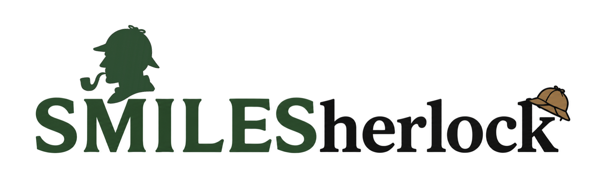

# SmileSherlock

<p align="center">
  
</p>

A high-performance, production-grade tool for SMILES validation, PubChem lookup, and chemical structure retrieval.

[](https://www.python.org/downloads/)
[](https://opensource.org/licenses/MIT)

## Features

- **SMILES Validation & Canonicalization** - Validate and standardize SMILES strings using RDKit
- **Multi-format Input** - Support for CSV, TSV, XLSX, SMI, SDF, and TXT files
- **Smart Auto-detection** - Automatically identify SMILES columns
- **PubChem Lookup** - Search by SMILES, CID, Name, InChI, and InChIKey
- **Rich Metadata** - Retrieve IUPAC name, molecular formula, mass, descriptors
- **Structure Downloads** - Get 2D/3D SDF, MOL, PDB, and PNG formats
- **Batch Processing** - Process hundreds of compounds with progress tracking
- **Async/Multithreading** - Fast parallel downloads with retry logic
- **Caching** - SQLite database for storing results locally
- **Multiple Exports** - Save results as CSV, Excel, or JSON
- **Python API** - Use directly in your scripts via `smilesherlock` module
- **CLI Tool** - Full-featured command-line interface with `smilesherlock` command

## Installation

### From PyPI (coming soon)

```bash
pip install smilesherlock
```

### Development Installation

Clone the repository and install in editable mode:

```bash
git clone https://github.com/AtharvaTilewale/SmileSherlock.git
cd SmileSherlock
pip install -e ".[dev]"
```

## Quick Start

### CLI Usage

```bash
# Show configuration and status
smilesherlock status

# Initialize directories and database
smilesherlock init

# Lookup a single compound
smilesherlock lookup "c1ccccc1"  # Benzene
smilesherlock lookup 5282253 --cid

# Batch process a file
smilesherlock batch compounds.csv --output results.xlsx --format xlsx

# Download structure
smilesherlock download 5282253 --format sdf --3d
```

### Python API (coming in Phase 2)

```python
from smilesherlock import lookup, lookup_file, download_structure

# Lookup single compound
result = lookup("c1ccccc1")
print(result.cid, result.iupac_name)

# Process file
results = lookup_file("compounds.csv", output_format="xlsx")

# Download structure
download_structure(5282253, format="sdf", dimension="3d")
```

## Requirements

- Python 3.10+
- RDKit (cheminformatics library)
- pandas (data handling)
- requests/aiohttp (HTTP)
- typer (CLI framework)
- rich/tqdm (UI/progress)

## Configuration

SmileSherlock respects environment variables for configuration:

```bash
export SMILESHERLOCK_CACHE_DIR=/custom/cache
export SMILESHERLOCK_LOG_LEVEL=DEBUG
export SMILESHERLOCK_MAX_WORKERS=8
```

Configuration is read from (in order):
1. Environment variables (prefix: `SMILESHERLOCK_`)
2. `.env` file in current directory
3. Built-in defaults

## Project Structure

```
SmileSherlock/
├── smilesherlock/          # Main package
│   ├── __init__.py         # Public API
│   ├── config.py           # Configuration management
│   ├── logging_config.py   # Logging setup
│   ├── cli.py              # CLI entry point
│   ├── cli/
│   │   ├── __init__.py
│   │   └── main.py         # Typer CLI application
│   ├── core/               # Core functionality (Phase 2)
│   │   ├── smiles.py       # SMILES validation
│   │   ├── pubchem.py      # PubChem API
│   │   └── database.py     # SQLite caching
│   └── utils/              # Utilities (Phase 2)
│       ├── file_io.py      # File parsing
│       ├── export.py       # Export formats
│       └── parsers.py      # Input parsers
├── tests/                  # Test suite
├── docs/                   # Documentation
├── pyproject.toml          # Package metadata & dependencies
├── README.md               # This file
└── LICENSE                 # MIT License
```

## Development Roadmap

### Phase 1: ✅ Project Structure & CLI Foundation
- [x] Modern `pyproject.toml` with all dependencies
- [x] Configuration management with `pydantic`
- [x] Logging setup with file rotation
- [x] CLI framework with `typer` and `rich`
- [x] Command placeholders for future features
- [x] Installable package (`pip install -e .`)

### Phase 2: PubChem Lookup & SMILES Validation
- [ ] RDKit SMILES validation and canonicalization
- [ ] PubChem REST API client (sync + async)
- [ ] SQLite database schema and caching
- [ ] Single compound lookup commands
- [ ] Metadata retrieval (IUPAC, formula, MW, descriptors)
- [ ] Unit and integration tests

### Phase 3: Batch Processing & File I/O
- [ ] Multi-format input parsing (CSV, TSV, XLSX, SMI, SDF)
- [ ] Auto-detection of SMILES column
- [ ] Batch lookup with progress bars
- [ ] Export to CSV, Excel, JSON
- [ ] Duplicate detection and removal

### Phase 4: Structure Downloads
- [ ] Download 2D/3D structures
- [ ] Support multiple formats (SDF, MOL, PDB, PNG)
- [ ] Resume incomplete downloads
- [ ] Batch structure downloads

### Phase 5: Advanced Features
- [ ] Async downloads and multithreading
- [ ] Retry logic and rate limiting
- [ ] Python API functions
- [ ] Advanced caching strategies
- [ ] Performance benchmarks

### Phase 6: Testing & Deployment
- [ ] Comprehensive unit tests
- [ ] Integration tests with live PubChem
- [ ] GitHub Actions CI/CD
- [ ] Code coverage reports
- [ ] PyPI release automation
- [ ] Complete documentation

## Contributing

Contributions are welcome! Please:

1. Fork the repository
2. Create a feature branch (`git checkout -b feature/amazing-feature`)
3. Commit changes (`git commit -m 'Add amazing feature'`)
4. Push to branch (`git push origin feature/amazing-feature`)
5. Open a Pull Request

## License

This project is licensed under the MIT License - see the [LICENSE](LICENSE) file for details.

## Citation

If you use SmileSherlock in your research, please cite:

```bibtex
@software{smilesherlock2026,
  author={Atharva Tilewale},
  title={SmileSherlock: High-performance SMILES validation and PubChem lookup},
  version={1.0.0},
  year={2026},
  url={https://github.com/AtharvaTilewale/SmileSherlock}
}
```

## Support

- **Documentation**: [https://smilesherlock.readthedocs.io](https://smilesherlock.readthedocs.io)
- **Issues**: [https://github.com/AtharvaTilewale/SmileSherlock/issues](https://github.com/AtharvaTilewale/SmileSherlock/issues)
- **Discussions**: [https://github.com/AtharvaTilewale/SmileSherlock/discussions](https://github.com/AtharvaTilewale/SmileSherlock/discussions)

## Changelog

See [CHANGELOG.md](CHANGELOG.md) for version history.

---

Made with ❤️ for the cheminformatics community
